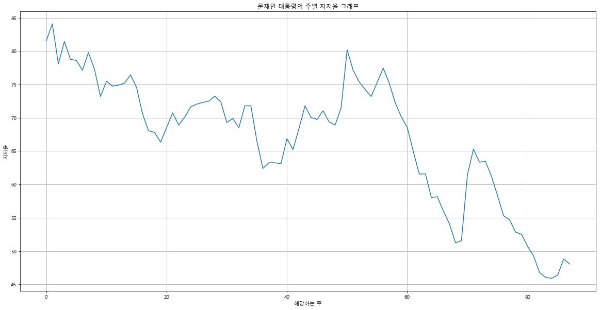
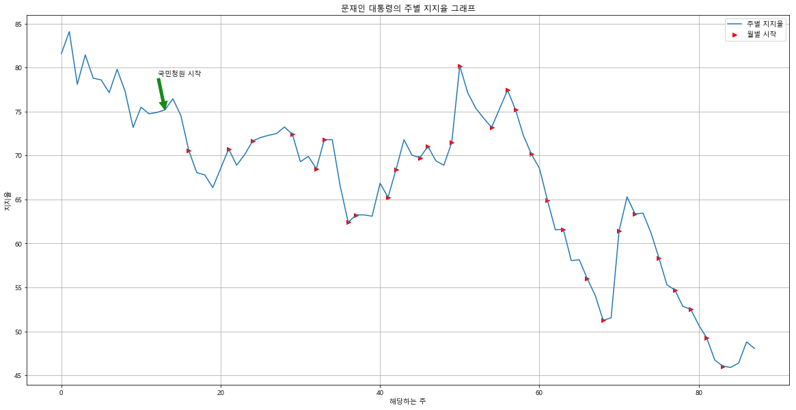
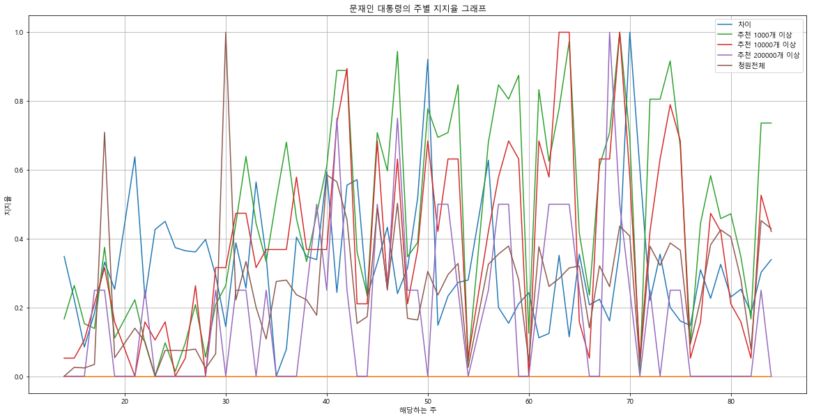
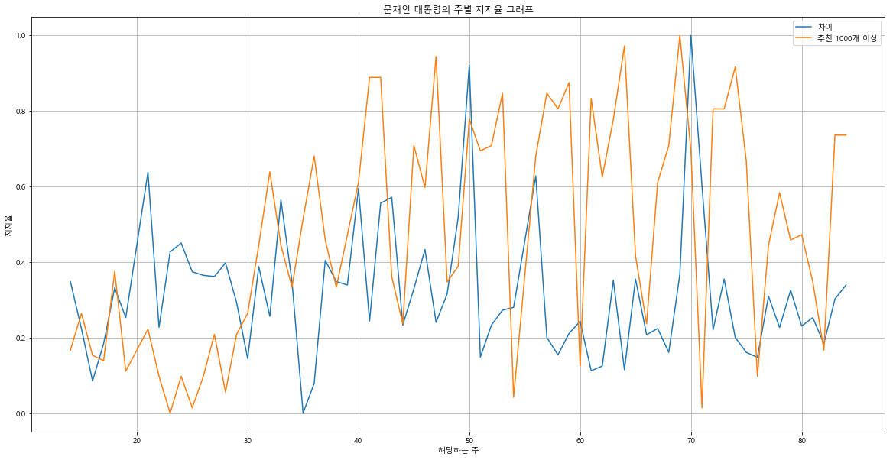
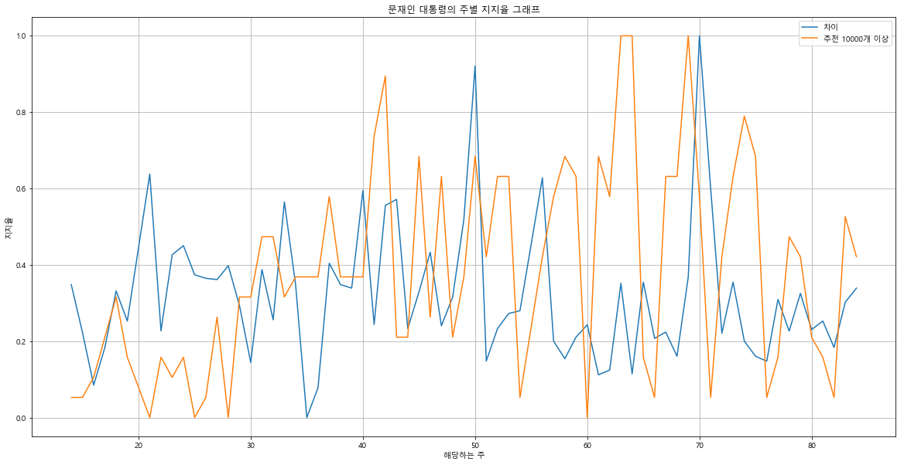
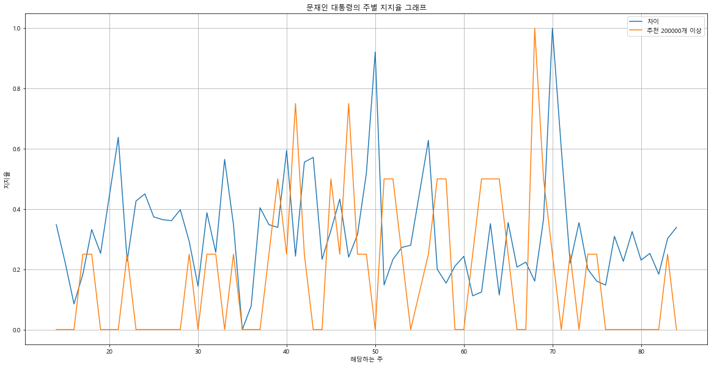
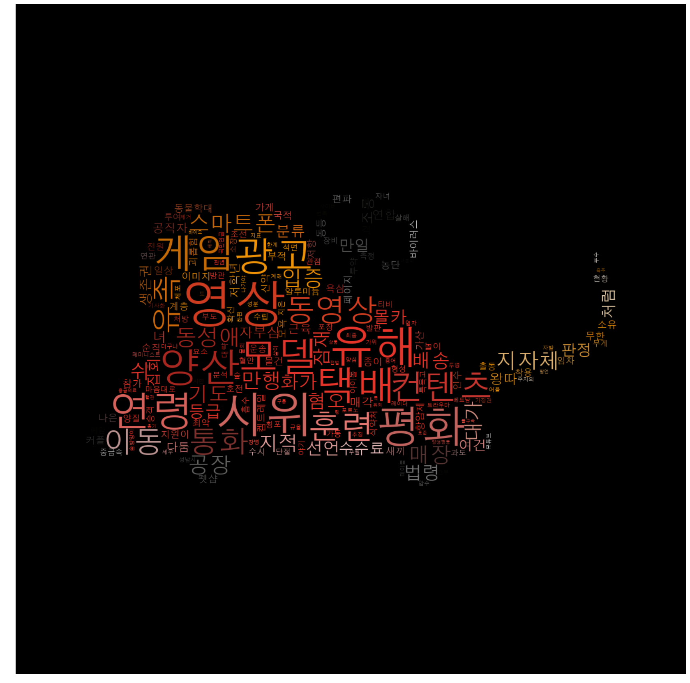
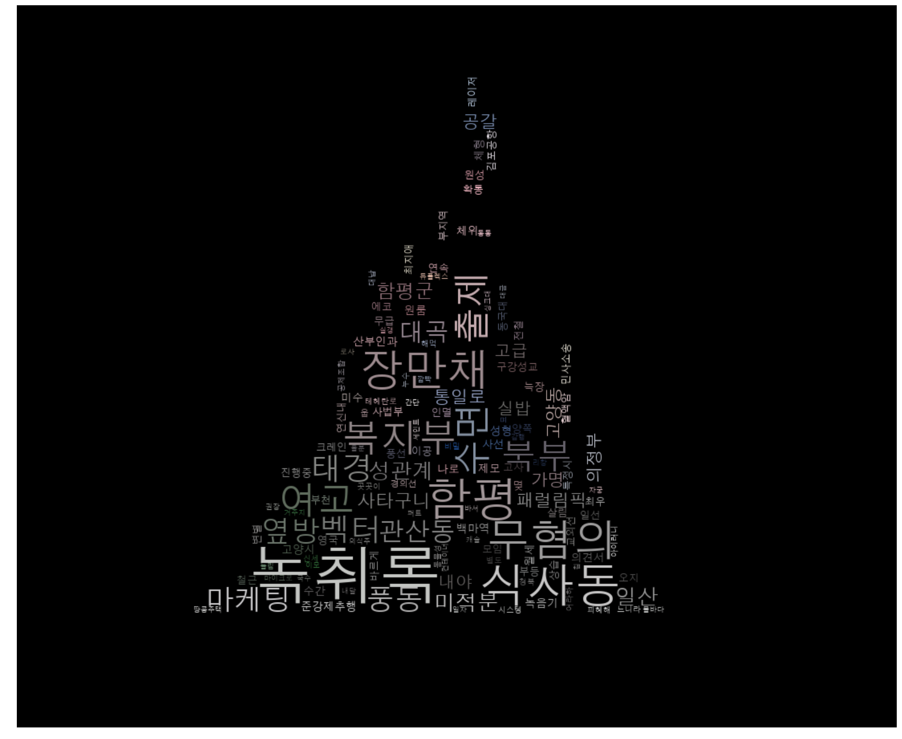

# National-Petition-Approval-Rating-Analysis

문재인 대통령의 지지율과 국민청원간에 상간관계를 분석합니다. **[관련 포스팅](https://newhiwoong.github.io/%EA%B5%AD%EB%AF%BC%EC%B2%AD%EC%9B%90/%EB%AC%B8%EC%9E%AC%EC%9D%B8-%EB%8C%80%ED%86%B5%EB%A0%B9-%EC%A7%80%EC%A7%80%EC%9C%A8-%EB%8D%B0%EC%9D%B4%ED%84%B0%EC%85%8B-CSV)**

## 지지율

[위키피디아 대한민국의 대통령 지지율](https://ko.wikipedia.org/wiki/%EB%8C%80%ED%95%9C%EB%AF%BC%EA%B5%AD%EC%9D%98_%EB%8C%80%ED%86%B5%EB%A0%B9_%EC%A7%80%EC%A7%80%EC%9C%A8)에서 문재인 대통령의 지지율을 가지고 text를 rating_data에 옮긴 후 **Python**을 이용해서 전처리를 진행한다.

### 주별 지지율 CSV 화

```python
df = pd.DataFrame.from_dict(dic = {"day" : day, "korea_gallop": korea_gallop, "real_meter" : real_meter})
df["approval_rating"] = (df["korea_gallop"].map(find_int) + df["real_meter"].map(find_int))
df["investigation_num"] = (df["korea_gallop"].map(zore_one) + df["real_meter"].map(zore_one))
df["approval_rating"] = df["approval_rating"].map(neatly_data)
df.to_csv("지지율.csv",index=False)
```

### 주별 지지율 그래프화

```python
plt.subplots(1, figsize = (20,7)) # 크기 지정 
plt.plot(dd,test)
plt.grid()
#plt.legend()
plt.xlabel("해당하는 주")
plt.ylabel("지지율")
plt.title("문재인 대통령의 주별 지지율 그래프")
plt.show()
```



```python
mpl.rc('font', family = font_name)

plt.subplots(1, figsize = (20,10)) # 크기 지정 

plt.plot(dd,test, label = "주별 지지율")

plt.scatter(kk,gg, color='r', marker='>', label = "월별 시작")

plt.annotate('국민청원 시작',
             xy=(13,75.2), 
             xytext=(-10, +50), textcoords='offset points', arrowprops = dict(color= 'g', alpha = 0.9))


plt.grid()
plt.legend()
plt.xlabel("해당하는 주")
plt.ylabel("지지율")
plt.title("문재인 대통령의 주별 지지율 그래프")

plt.show()
```



## 국민청원수와 지지율 간에 상관관계 찾기

### week_dict 가져오기

```python
wdf = pd.read_csv("week_dict.csv")
week_dict = {}
for row in wdf.itertuples(index=True, name='Pandas'):
    week_dict[getattr(row, "week")] = getattr(row, "days").split(',')
week_dict
```

### week_dict에서 필요한 부분 추가

```python
petition_num = []
petition_num_up1000 = []
petition_num_up10000 = []
petition_num_up200000 = []
for week_n in week_dict:
    test_index = dfa[dfa["num"]==0]
    for wd in week_dict[week_n]:
        test_index = test_index.append(dfa[dfa["start-days"] == wd])
    petition_num.append(len(test_index["num"]))
    petition_num_up1000.append(len(test_index[test_index["count"]>=1000]["num"]))
    petition_num_up10000.append(len(test_index[test_index["count"]>=10000]["num"]))
    petition_num_up200000.append(len(test_index[test_index["count"]>=200000]["num"]))
```

### 데이터 정규화

```python
from sklearn import preprocessing

x = df.values #returns a numpy array
min_max_scaler = preprocessing.MinMaxScaler()
x_scaled = min_max_scaler.fit_transform(x)
dfs = pd.DataFrame(x_scaled,  columns= names)
dfs
```

### 그래프

```python
mpl.rc('font', family = font_name)

plt.subplots(1, figsize = (20,10)) # 크기 지정 

plt.plot(nd,list(dfs["차이"]),label="차이")
plt.plot(nd,[0 for _ in nd])
plt.plot(nd,list(dfs["추천 1000개 이상"]),label="추천 1000개 이상")
plt.plot(nd,list(dfs["추천 10000개 이상"]),label="추천 10000개 이상")
plt.plot(nd,list(dfs["추천 200000개 이상"]),label="추천 200000개 이상")
plt.plot(nd,list(dfs["청원전체"]),label="청원전체")

plt.grid()
plt.legend()
plt.xlabel("해당하는 주")
plt.ylabel("지지율")
plt.title("문재인 대통령의 주별 지지율 그래프")

plt.show()
```










## 벡터만들기

### 주별 키워드 찾기

```python
week_keyword = []
for week_n in week_dict:
    test_index = dfa[dfa["num"]==0]
    for wd in week_dict[week_n]:
        df1 = test_index.append(dfa[dfa["start-days"] == wd])
    text = list(df1["petition_overview"])
    text = ' '.join(text)
    ko_con_text = text
    print(len(text))
    tokens_ko = t.nouns(ko_con_text)
    stop_words = ['직','제','저', '이','그','때','및','것이','합니다.','\\n',':','','거','수','그' ,"합","이","있는","있습니다.","것","및","하지만","때문에"]
    tokens_ko = [each_word for each_word in tokens_ko if each_word not in stop_words]
    text = ' '.join(tokens_ko)
    ko = nltk.Text(tokens_ko, name= '청원')
    data = ko.vocab().most_common(500)
    tmp_data = dict(data)
    week_keyword.append(tmp_data)
```

### 주별 키워드에 맞게 벡터 제작

```python
conut_lists = []
for wk in week_keyword:
    conut_list = []
    for one_set in all_set:
        try:
            conut_list.append(wk[one_set])
        except:
            conut_list.append(0)
    conut_lists.append(conut_list)
    
for i in range(len(all_set)):
    tlist = []
    for j in range(len(conut_lists)):
        tlist.append(conut_lists[j][i])
    tlist.append(all_set[i])
    test.loc[i] = tlist
    
test
```


### 필요한 데이터 가져오기

```python
test = pd.read_csv("week_keyword_up1000.csv")

test_b = pd.read_csv("week_keyword_up1000_bool.csv")

rdf = pd.read_csv("rating_information.csv")
```

## 지지율 당 키워드

### 키워드 저장

#### 찾는 함수
``` python
def find_same_any(test, wlist):
    a_list = list(test)
    del a_list[a_list.index('alls')]
    del a_list[a_list.index('keyword')]
    for i in wlist:
        del a_list[a_list.index(str(i))]
    
    rdf = test[test["35"]==43]
    for _, row in test.iterrows():
        k = 0
        for tw in a_list:
            if(row[str(tw)]):
                k=1
        if not(k):
            rdf = rdf.append(row)
    return rdf
```
or
``` python
def find_only_sum(test, wlist):
    rdf = test[test["35"]==43]
    for _, row in test.iterrows():
        w = 0
        for tw in wlist:
            w += row[str(tw)]
        if w == row["alls"]:
            rdf = rdf.append(row)
    return rdf
```

#### 지지율이 -일때
``` python
for i in range(0,-55,-5):
    i/=10
    wlist_m = list(rdf[rdf["차이"]<=i]["대통령 주"])
    print(i, " : ",wlist_m)
    df_m = find_same_any(test, wlist_m)
    df_m.to_csv("minus_"+str(i)+"_approval_rating.csv", index=False, encoding='ms949')
```

#### 지지율이 +일때
``` python
for i in range(0,55,5):
    i/=10
    wlist_m = list(rdf[rdf["차이"]>=i]["대통령 주"])
    print(i, " : ",wlist_m)
    df_m = find_same_any(test, wlist_m)
    df_m.to_csv("plus_"+str(i)+"_approval_rating.csv", index=False,encoding='ms949')
```

### Word Cloud

#### dict 만들기
``` python
def dic_find_same_any(test, wlist):
    dic = {}
    a_list = list(test)
    del a_list[a_list.index('alls')]
    del a_list[a_list.index('keyword')]
    for i in wlist:
        del a_list[a_list.index(str(i))]
    
    rdf = test[test["35"]==43]
    for _, row in test.iterrows():
        k = 0
        for tw in a_list:
            if(row[str(tw)]):
                k=1
        if not(k):
            rdf = rdf.append(row)
            dic[row["keyword"]] = row["alls"]
            #print(row["keyword"])
            #print(row["alls"])
    return dic
```

#### Word Cloud Code
``` python
def make_cloud(tmp_data, back_image_n,state="no", font_n = "HANDotumExt.ttf",background_color_n='white', max_font_size_n = 40):
    
    #폰트 지정
    if platform.system() == "Linux":
        #/usr/share/fonts/truetype/unfonts-core/UnDinaru.ttf
        font_path_n = "/usr/share/fonts/truetype/nanum/NanumBarunGothic.ttf"
    elif platform.system() == "Windows":
        #c:/Windows/Fonts/malgun.ttf
        font_path_n = "c:/Windows/Fonts/"+font_n
    elif platform.system() == "Darwin":
        #AppleGothic
        font_path_n = font_n
    else:
        print("Unknwon system")
        return False
    
    font_name = font_manager.FontProperties(fname=font_path_n).get_name()
    rc('font', family=font_name)
    %matplotlib inline
    
    #배경사진 지정
    back_image = np.array(Image.open("image/"+back_image_n))
    image_colors = ImageColorGenerator(back_image)

    
    wordcloud = WordCloud(font_path= font_path_n,
                         relative_scaling = 0.2, mask=back_image,
                         background_color=background_color_n,
                          min_font_size=1, max_font_size=max_font_size_n
                         ).generate_from_frequencies(tmp_data)
    plt.figure(figsize=(30,30))
    
    #설정에 맞게 색깔 변경
    if state == "no":
        plt.imshow(wordcloud)
    elif state == "img":
        plt.imshow(wordcloud.recolor(color_func=image_colors) ,interpolation='bilinear')
    elif state == "grey":
        plt.imshow(wordcloud.recolor(color_func=grey_color_func, random_state=3) ,interpolation='bilinear')
    else:
        plt.imshow(wordcloud.recolor(color_func=lambda *args, **kwargs: state, random_state=3) ,interpolation='bilinear')
    plt.axis("off")
    
    #fig = plt.figure(figsize=(30,30))
    plt.show()
    #fig.savefig('temp2.png', dpi=fig.dpi)
```

#### 지지율이 +일때
```python
for t,i in enumerate(range(0,50,5)):
    i/=10
    wlist_m = list(rdf[rdf["차이"]>=i]["대통령 주"])
    print(i, " : ",wlist_m)
    dic_n = dic_find_same_any(test, wlist_m)
    make_cloud(dic_n,back_image_n=str(t+1)+".jpg" ,state="img", max_font_size_n = 100,font_n="H2GTRM.TTF",background_color_n="black")
```

#### 지지율이 -일때
```python
for t,i in enumerate(range(0,-50,-5)):
    i/=10
    wlist_m = list(rdf[rdf["차이"]<=i]["대통령 주"])
    print(i, " : ",wlist_m)
    dic_n = dic_find_same_any(test, wlist_m)
    make_cloud(dic_n,back_image_n=str(t+1)+".jpg" ,state="img", max_font_size_n = 100,font_n="H2GTRM.TTF",background_color_n="black")
```

### 예시





