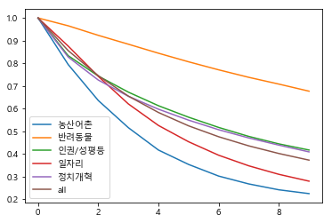
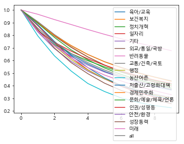
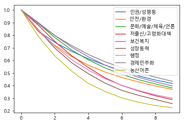
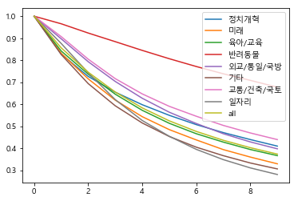

# National-Petition-Data-Analysis
국민청원 내용을 분석합니다.

## 데이터 구분
추천 수별로 청원을 찾아 그래프로 만들어서 국민들이 관심을 가지고 분야와 월을 찾습니다. 

### 추천 수별로 분야별 청원 수 찾는 함수
```
def fied_names_num(df, names):
    lists = []
    for name in names:
        if(name=="all"):
            break
        #print(name, " : ", len(df[df["category"]==name]["category"]))
        lists.append(len(df[df["category"]==name]["category"]))
    #print("all : ",len(df["category"]))
    lists.append(len(df["category"]))
    return lists
```

### 추천 숫자 별로 청원 찾기 제작
```
for i in range(400000):
    lists = fied_names_num(df[df["count"]>=i],names)
    for j,name in enumerate(names):
        alls[name].append(lists[j])
```


## 그래프 만들기 
 위에서 청원 만든 추천 수별 청원을 기반을 그래프 제작을 진행합니다.

### 정규화
 시작 부분이 1이 되도록 정규화를 진행합니다. 
```
from sklearn import preprocessing

x = df.values #returns a numpy array
min_max_scaler = preprocessing.MinMaxScaler()
x_scaled = min_max_scaler.fit_transform(x)
dfs = pd.DataFrame(x_scaled,  columns= names)
dfs
```
### 그래프 제작
 원하는 추천 수까지의 그래프를 제작합니다.  
```
i = 10
plt.figure(); dfs4[:i].plot(); plt.figure(); dfs[:i].plot();

plt.figure(); dfs3[:i].plot(); plt.figure(); dfs2[:i].plot();
```

### 예시 








위 과정을 정규화를 제외하고 월별 그래프도 제작합니다.